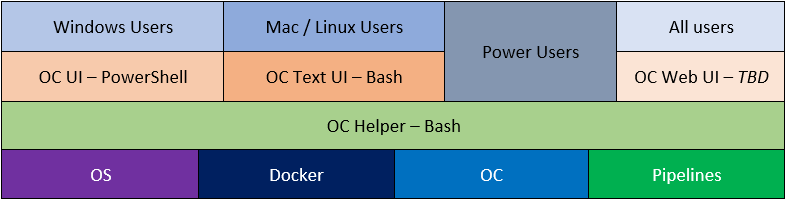
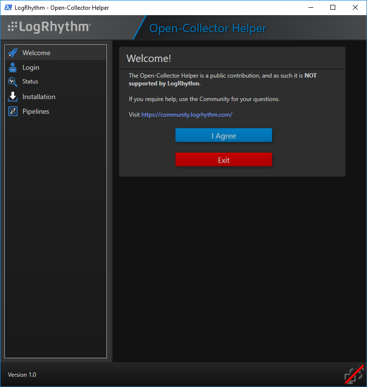
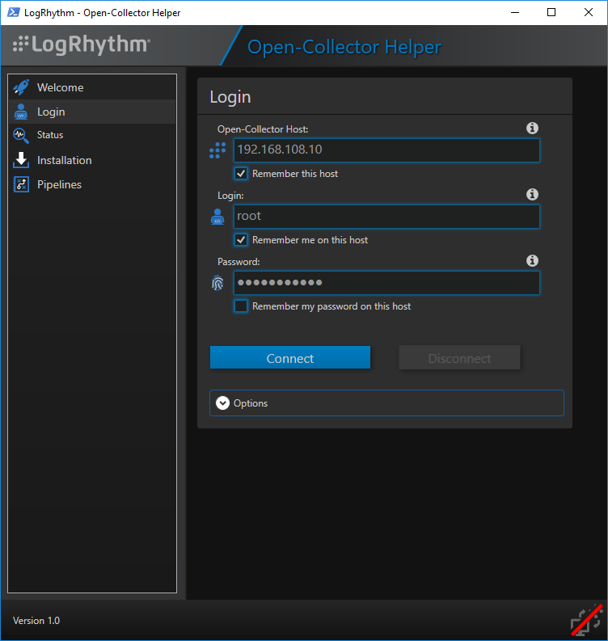
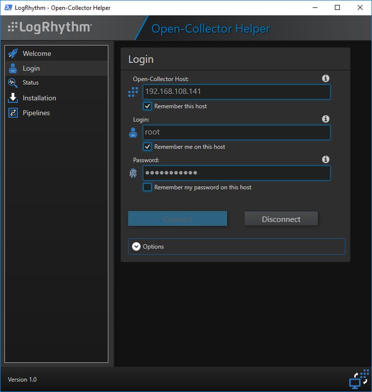
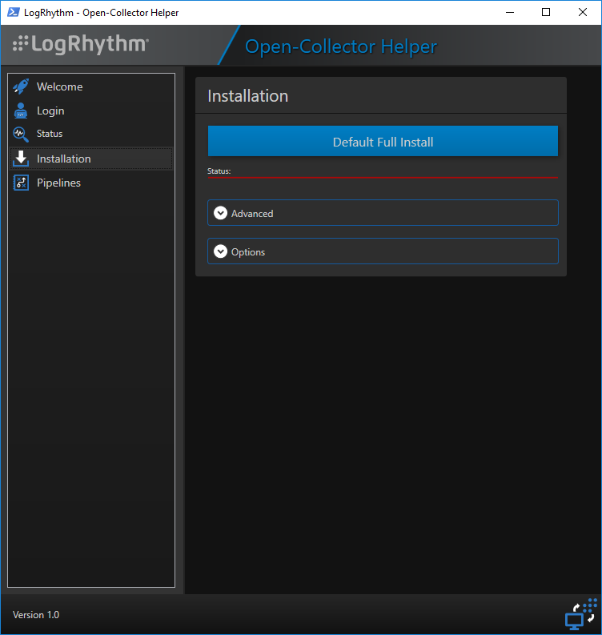
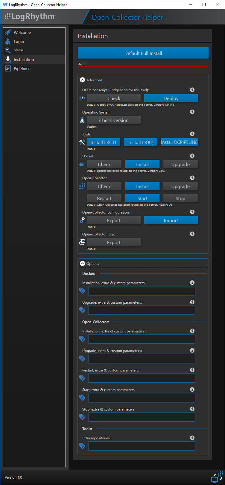
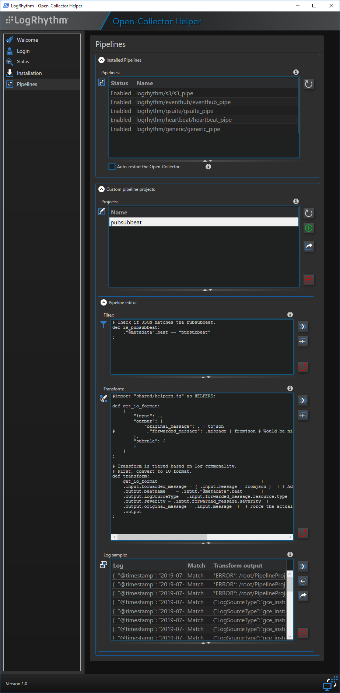

# GUI for LogRhythm Open-Collector (OpenCollector-UI)

Hi there,

This project, is aimed at creating an easy to use Graphical User Interface for LogRhythm Open-Collector.

LogRhythm Open-Collector runs on CoreOS, CentOS (an under RHEL if approved by Product Management), and relies on several components to run (Docker, etc...).
This GUI is designed to make both **installation**, **monitoring** and **managing** the Open-Collector stack **easy**, as well as authoring and testing custom Filters and Transform in the same App.

The GUI project englobes several sub projects:
- A Command Line tool (```OCHelper.sh```) to do actions on the Open-Collector machine from the CLI. Inputing and Outputing in strict formats (Raw or JSON), so be easily used as a point of entry for a user as well as other tools and UIs. See this as the API back-end.
- A PowerShell based GUI (```OC_UI-v?.?.ps1```) for Windows -*and Mac if install PowerShell there*- that relies on the CLI tool above
- A Menu based UI, all in text to be used on the CLI
- A Web based interface for everybody, that will rely on the CLI tool too.

### Stack:
The whole stack is planed to be like this:


### Status: 
*(as of 2019-09-04)*
-  CLI tool (```OCHelper.sh```)
-  PowerShell GUI (```OC_UI-v?.?.ps1```)
-  Text/Menu based UI
- Web UI

### Screenshots: 
*(as of 2019-09-04)*
#### - PowerShell based GUI (```OC_UI-v1.0.ps1```): 
 
 
 
 
 
 
 

### Download:
Latest versions:
- PowerShell based GUI (```OC_UI-v1.0.ps1```)
  - Version 1.0 : [Download](Releases/Release-OC_UI-v1.0.20190904.zip) [:floppy_disk:](Releases/Release-OC_UI-v1.0.20190904.zip)

Contact me if you would like to be involded.

Cheers,

 Tony

